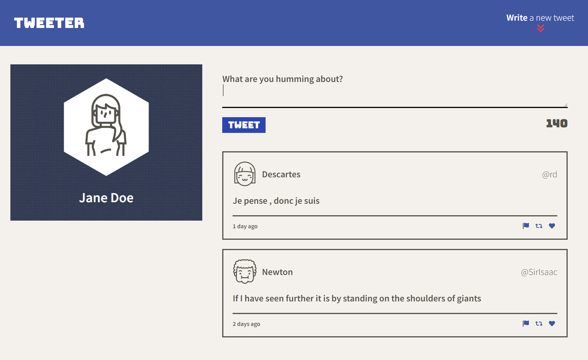
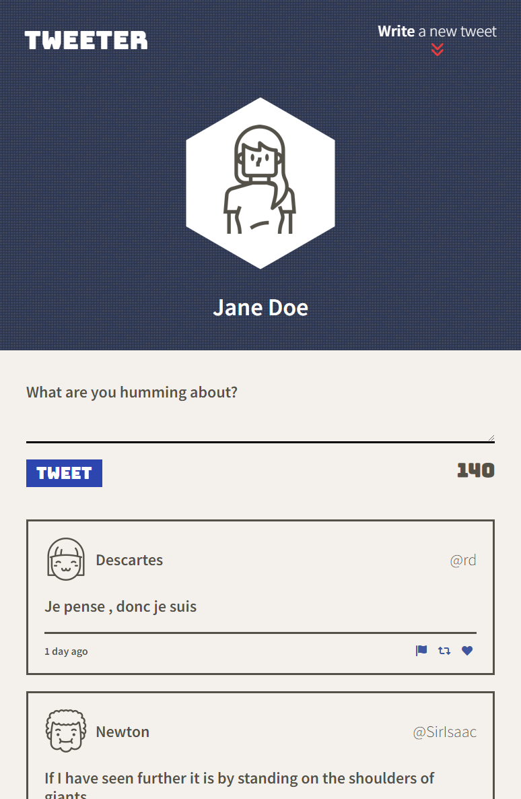
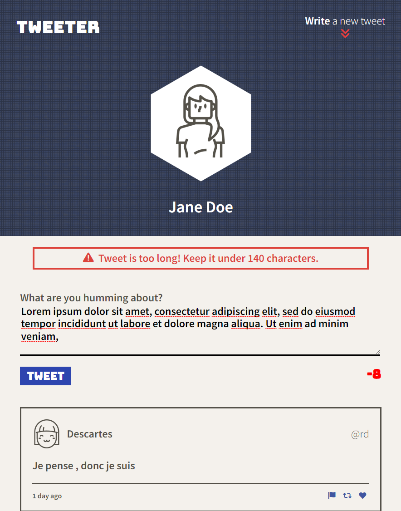

# Tweeter Project

Tweeter is a simple, single-page Twitter clone.

## Final Product
### Desktop View

### Mobile View

## Getting Started

- Install all dependencies with `npm install`
- Run the development web server with `npm run local`

## Dependencies

- Express
- Node 5.10.x or above
